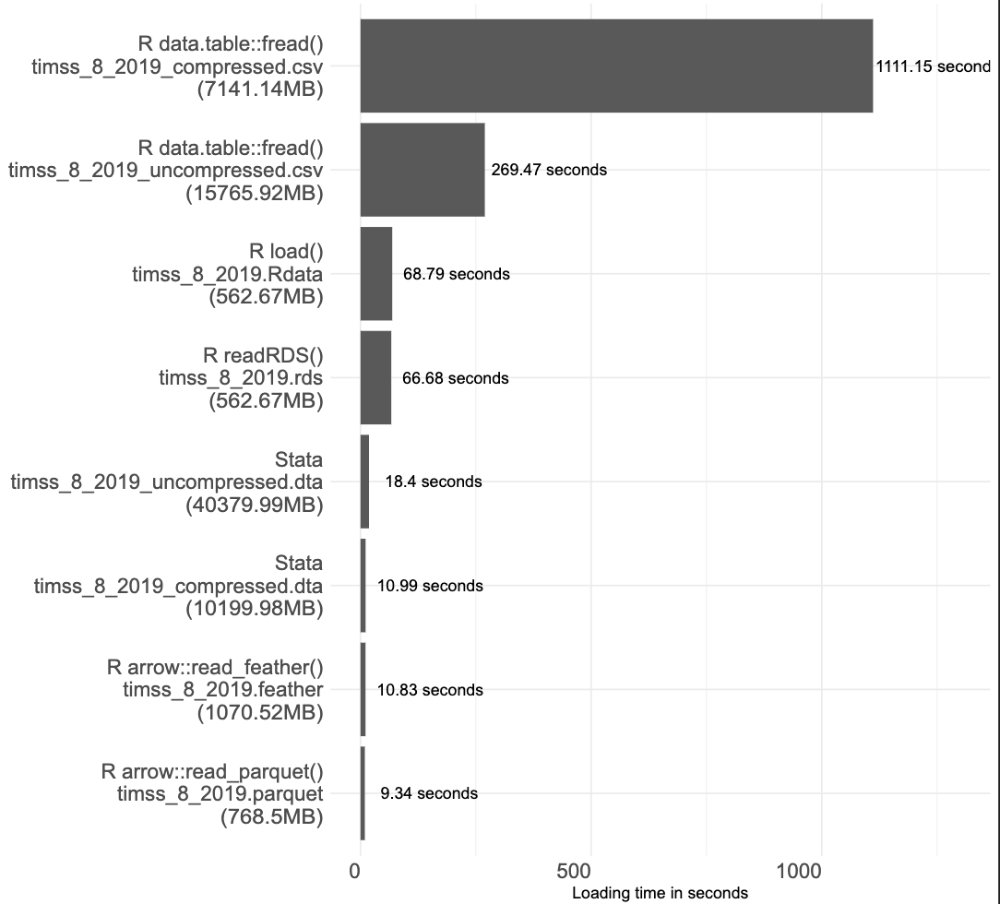

### this repository contains the stata and r scripts used for a comparison of file sizes and processing times of different file formats for data storage and processing. 

The data used in this comparison is the international Database (grade 8) 2019 TIMSS data which can be downloaded from the TIMSS website [here](https://timss2019.org/international-database/).

- I first converted the sas-files to a csv file (using R).  that led to the file called timss_8_2019_uncompressed.csv.
- I then converted that file into Stat format using R. That  led to the file called timss_8_2019_uncompressed.dta.
- I then compressed the stata file in Stata with the compress command. That took more than 24 hours and lead to the file called timss_8_2019_compressed.dta. Which was then also saved as a csv file called timss_8_2019_compressed.csv.
- The other file formats are all created with R based on the timss_8_2019_uncompressed.csv file using default settings.

A few notes:

- This is "anecdotal" as it is only based on one example.
- This loads the full datasets. I do not exploit capabilities of the file formats to only load parts of the data and computation speed.

Here is the result

